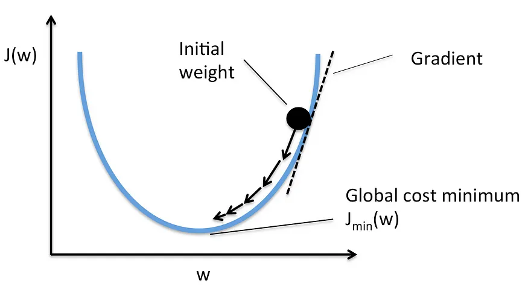

The report must be in imrad

# 1. Introduction

Olive flies are among one of the many species of flies that live around plants and stocks. They are considered as being a pest to the olives. That is why it can be benifitial to olive farmers to identify the flies on their stocks. There are however many more types of flies that exist on the olives that might not be harmfull to the plants. Therefore a method of just counting every fly would not work as that would result in false data and potentially incorrect and inadequate pest control. In order to be able to better control the flies and protect the olives, a farmer must know roughly how many olive flies there actually are on the olives.

This project aims to answer the question:

> How can a logistic regression model be constructed that is capable of identifying olive flies?

This kind of classification model is a perfect example of multiple logistic regression and a good first project for new learners. The project involves important fundemental steps like data pre-processing, model construction and training and model evaluation. This report describes and outlines the process of developing such a machine learning model. It aims to outline the methods used to pre-process the data and construct the model itself, the results of the model and closes with an analysis and discussion about pre-processing and training alternatives and approaches.

# 2. Methods

## 2.1. Data collection and pre-processing

The dataset consists of two image classes provided as part of the assignment: images containing olive flies and images containing other insects or objects found on olive plants. All images were resized to a fixed resolution of 170 × 170 pixels to ensure consistent input dimensions.
Pre-processing focused on isolating the insect from the background. Foreground extraction was performed using grayscale conversion followed by inverse Otsu thresholding, assuming the insect appears darker than the background. Morphological closing was applied to reduce noise, after which the largest connected component was selected as the foreground region. All non-foreground pixels were replaced with a white background.
To remove poorly extracted images, the ratio of foreground pixels to total pixels was computed for each image. Images exceeding a manually chosen threshold were considered faulty and removed from the dataset.
Data augmentation was applied to the olive fly class using horizontal flipping and small rotations of ±15 degrees to increase variation. After cleaning, the dataset was rebalanced by augmenting the olive fly class and randomly downsampling the non-olive fly class so that both classes contained an equal number of images.

## 2.2. Feature extraction

Histogram of Oriented Gradients features were extracted to capture shape and edge information of the insects. Images were converted to grayscale and normalized before computing HOG descriptors with fixed orientation bins, cell size, and block size.
Color information was captured using normalized three-dimensional RGB color histograms. Each image was converted to RGB space, and a fixed number of bins per channel was used to represent color distribution.
In addition to using HOG and color features separately, a combined feature representation was created by concatenating both feature vectors. This allowed the model to leverage both structural and color-based information during classification.

## 2.3. Model training

### 2.3.1. Sigmoid function

The nature of the problem is a binary classification problem. An object in an image must be identifed a "olive fly" or "not olive fly". Because of this very nature of the problem, a logistic regression model is chosen for the classification task. A logistic regression model is wel suited for these types of binary classification because it outputs a value between $0$ and $1$. Therefore we can apply the following logic:

$$
\hat{y} =
\begin{cases}
1, & \text{if } f(x) \ge 0.5,\\[4pt]
0, & \text{if } f(x) < 0.5.
\end{cases}
$$

A linear regression model works using the sigmoid function. This function essentially squeezed the output of the model between $0$ and $1$ by using the logarithm. It can be noted as

$$
\sigma(z)=\frac{1}{1+e^{-z}}
$$

Here, $z$ is essentially our multiple linear regression function $f(x) = \beta_0 + \beta_1 x_1 + \beta_2 x_2 + \dots + \beta_n x_n$

In the code, this sigmoid function is implemented using the numpy library.

```python
def sigmoid(z):
    return 1 / (1 + np.exp(-z))
```

### 2.3.2. Forward propogation

Of course, when the model is not yet trained, we do not know the $\beta_{1..n}$. However, to predict an outcome we must solve the multiple linear regression problem, to afterwards feed it to the sigmoid function in order for it to output the a prediction between $0$ and $1$. This value can then be interpreted as $true$ or $false$ and we have our prediction.

Mathmatically, this is represented as:

$$
\begin{aligned}
z &= \beta_0 + \beta_1 x_1 + \beta_2 x_2 + \dots + \beta_n x_n \\
\sigma(z) &= \frac{1}{1+e^{-z}}
\end{aligned}
$$

And thats actually everything that is to the forward propagation from a mathematical perspective. There is however a big optimization technique that we can use to speed up the multiple linear regression calucation. Because all of the dependend variables $X = \set{x_1, x_2, \dots, x_n}$, independent variables $Y=\set{y_1, y_2, \dots, y_n}$ and the weights and bias can all be represented using matrices.

$$
X = \begin{bmatrix}
& x_{11} & x_{12} & \cdots & x_{1m} \\
& x_{21} & x_{22} & \cdots & x_{2m} \\
& x_{31} & x_{32} & \cdots & x_{3m} \\
\vdots & \vdots & \vdots & \ddots & \vdots \\
& x_{n1} & x_{n2} & \cdots & x_{nm}
\end{bmatrix}, \qquad
Y = \begin{bmatrix}
y_1 \\ y_2 \\ y_3 \\ \vdots \\ y_n
\end{bmatrix},
\qquad
\beta = \begin{bmatrix}
\beta_1 \\ \beta_2 \\ \beta_3 \\ \vdots \\ \beta_m
\end{bmatrix}
\qquad
\beta_0 = 0.0
$$

We can then use clever matrix operations to calculate the predictions in a batch, so we can calculate all the prediction at once using these matrix operations. We can calculate $\hat{y}$ by taking the dot product of $Y = X \times \beta + \beta_0$ And then we can directly feed in the result into the sigmoid function. In code this is implemented as follows

```python
Y_hat = sigmoid(np.dot(X, w) + b)
```

### 2.3.3. Gradient decent & backward propagation

With weights and biases of $0$ we cannot make accurate predictions. For that we need to train the model. And during the training we want to know how well our model is doing, so we can tweak some parameters if necessery. For the evaluation of the model we use a loss function. This function captures our models' predictions with how far it is off from reality. So to calculate this, we need the predictions and the actual labels that we classified the data with ourselves.

In logistic regression, we use the log loss function, or cross-entropy loss (GeeksforGeeks, ‘Cost Function in Logistic Regression in Machine Learning’.). This function is noted as follows

$$
C(h \sigma(x), y) = -\frac{1}{n}\sum_{i=1}^n\Big( y_i\log\big(h_\sigma(x_i)\big) + (1-y_i)\log\big(1 - h_\sigma(x_i)\big)\Big)
$$

This cost function captures the how far our model is off from the true predictions we gave it. And in order to train our model, the goal is to minimize this cost function, such that the loss, or error, of the model becomes as small as possible.

This loss function is implemented as the following code:

```python
cost = (-1/n) * np.sum(Y * np.log(Y_hat) + (1-Y) * np.log(1-Y_hat))
```

This training is then done using gradient decent. With gradient decent our goal is to minimize the cost function to the local minima. We can see this as a parabolic function, we are somewhere along the slope, and we want to step down towards the valley of that slope.

(Cost Function in Logistic Regression in Machine Learning)

To do this, we have a two main parameters we can tweak. That is the weights, and the bias. Because $X=\set{x_1, x_2, ..., x_n}$ are our fixed features. We calculate the new values for the weights and biases by calculating the partial derivative of the cost function, with respect to the weights and biasses. When we use the chain rule on the cost function, we see that the partial derivatives, with respect to the weights and biasses become fairly simple.

$$
\begin{align*}
\frac{\partial}{\partial b} C(w, b) &= \frac{\sum_{i=1}^{n}  h\sigma(x_i) - y_i}{n} \\
\frac{\partial}{\partial w} C(w, b) &= \frac{\sum_{i=1}^{n} (h\sigma(x_i) - y_i)x_i}{n}
\end{align*}
$$

Using these partial derivatives, we can then update the respective weights and biasses to make the model (hopefully) more accurate, and decrease the loss.

This process of gradient decent can also be done using matrices and matrix operations. In this formula we see $h\sigma(x_i)-y_i$, which calculates the residual. Or in other words, it calculates the amount the models' prediction was off from the actual label. In order to calculate these residuals in bulk, we can easily just subtract our label matrix from the predictions matrix, which gives us a residual matrix.

$$
r = \begin{bmatrix}
\hat{y}_0 - y_0 \\
\hat{y}_1 - y_1 \\
\hat{y}_2 - y_2 \\
\vdots \\
\hat{y}_n - y_n
\end{bmatrix}
$$

In order to calculate the partial derivative for the weights. we must multiply the residual once more with the feature ($(h\sigma(x) - y)x$). However when we want to do this in batch, usign matrix operations, we must first transpose the feature matrix $X$ such that the shapes are compatible. After we have done this, we can easily use the following formula to calculate the partial derivatives for $w$ and $b$.

$$
\begin{align*}
\frac{\partial}{\partial w} C(w) = X^{T}r/n \\
\frac{\partial}{\partial b} C(b) = r/n
\end{align*}
$$

In the code, this is implemented as follows

```python
residuals = Y_hat - Y
XTransposed = np.transpose(X)

dw = (1/n) * (np.dot(XTransposed, residuals))
db = (1/n) * np.sum(residuals)
```

In order to update the respective weights and bias, we must take the our previous weights and bias, and subtract the learning rate ($\alpha$) multiplied by the partial derivative from that.

$$
\begin{align*}
w' &= w - \alpha \frac{\partial}{\partial w} C(w) \\
b' &= b - \alpha \frac{\partial}{\partial b} C(b)
\end{align*}
$$

In code this is implemented as follows

```python
w = w - learning_rate * dw
b = b - learning_rate * db
```

And that concludes one iteration of training. After this iteration, you propagate forward again, calculate the loss and update the weights and bias. For the full model trainging, the amount of iterations and the learning rate are arbitrarily determined. Often a learning rate of $0.1$ is much too large.

### 2.3.4. Parameters used

For this fruit fly identification model a learning rate of $0.01$ has been used, with $2000$ iterations. However, the optimal values for this vary based on feature size and training data. Sometimes a smaller learning rate is more optimal, sometimes more iterations are required.

# Results

<Describe the model was trained on 80% of the data, and evaluated on 20%>
<Describe training params, and why they are good>
<Describe the different scores per model with different feature algorithms>
<Describe the training and test accuracy>
<Describe Precision, recall and F1 score>

# Analysis & Discussion

<Describe what the results mean>
<Describe the impact of the different feature algorithms>
<Describe other alternative feature generations>
<Describe impact of potential PCA (dimensionality reduction) usage>

# Conclusion

<Describe what this project did once more>
<Describe what the results mean for the reseach question>
<Answer the research question>

# Bibliography
